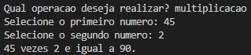
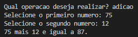

# Operações Matemáticas Básicas com JavaScript - Gama Academy - XP 44 🚀

## Sobre a Gama Academy 🏫

<br>

Empresa de educação que prepara talentos para o mercado digital. Em seus programas educacionais, as pessoas participantes enfrentam desafios reais, se conectam com empresas digitais, recebem mentorias de profissionais que estão mandando bem em suas áreas e, ainda têm a oportunidade de ensinar e aprender com a nossa comunidade visando o emprego, transição de carreira e o life long learning.

<br>

## Sobre o Gama Experience 👨🏽‍💻

<br>

É um curso com duração de 6 meses, com o objetivo de formar os melhores juniores do mercado, nas áreas de Desenvolvimento Web e Designers UX/UI! A primeira versão do curso foi lançada pela Gama Academy em 2016 e já empregou mais de 3.000 pessoas.  A versão atual contém mais de 810 horas de aulas, desafios e mentorias, com foco na  empregabilidade de nossos estudantes!

<br>

## Sobre o Exercício ✔️

<br>

Atividade consiste em executar operações matemáticas básicas diretamente no terminal. Para isso foram utilizadas as seguintes ferramentas e conteúdos:

<br>

* JavaScript;
* Node;
* Template Liteals;
* ReadLine-Sync.

<br>

## Execução 📋

<br>

* Clone este repositório remoto em seu equipamento:
```
git@github.com:DuAlexandre/op-basicas-gama-xp44.git
```

* Instale as dependências do ReadLine-Sync:
```
npm i readline-sync
```
* Inicie o programa:
```
npm start
```
* Selecione uma dentre as cinco operações básicas:
```
adicao
- Executa a operação de adição entre dois números.
```
```
subtracao
- Executa a operação de subtração entre dois números.
```
```
multiplicacao
- Executa a operação de multiplicação entre dois números.
```
```
divisao
- Executa a operação de divisão entre dois números.
```
```
modulo
- Verifica o resto da divisão entre dois números.
```

<br>

## Prints de execução 📷

<br>



<br>

